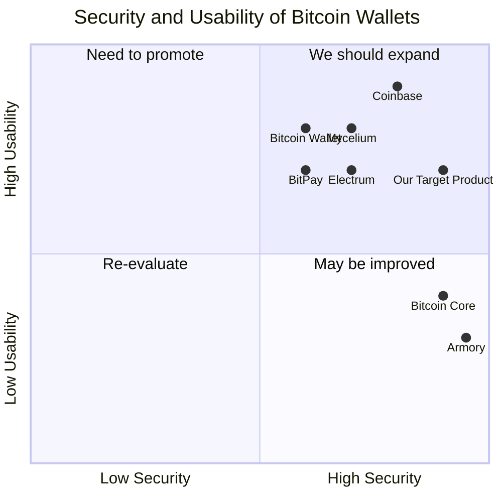

## Original Requirements
The boss has asked for a C++ based bitcoin wallet with minimal use of outside libraries.

## Product Goals
```python
[
    "Create a secure and efficient Bitcoin wallet using C++",
    "Minimize the use of outside libraries to ensure code integrity",
    "Ensure the wallet is user-friendly and easy to navigate"
]
```

## User Stories
```python
[
    "As a user, I want to be able to securely store my Bitcoin in the wallet",
    "As a user, I want to be able to easily send and receive Bitcoin",
    "As a user, I want to be able to check my balance at any time",
    "As a user, I want to be sure that my wallet is secure and my Bitcoin is safe",
    "As a user, I want to be able to access my wallet from different devices"
]
```

## Competitive Analysis
```python
[
    "Bitcoin Core: The original Bitcoin wallet, but it requires downloading the entire blockchain",
    "Electrum: A lightweight Bitcoin wallet, but it's not written in C++",
    "Armory: A secure Bitcoin wallet, but it's difficult to use and requires Bitcoin Core",
    "Bitcoin Wallet: A simple and easy to use Bitcoin wallet, but it's only available on Android",
    "Mycelium: A popular mobile Bitcoin wallet, but it's not available on all platforms",
    "Coinbase: A widely used Bitcoin wallet, but it's not open source",
    "BitPay: A Bitcoin wallet with a focus on merchants, but it's not as secure as other wallets"
]
```

## Competitive Quadrant Chart


## Requirement Analysis
The product should be a Bitcoin wallet written in C++ with minimal use of outside libraries. It should be secure, efficient, and user-friendly. The wallet should allow users to send and receive Bitcoin, check their balance, and access their wallet from different devices.

## Requirement Pool
```python
[
    ("Implement secure storage for Bitcoin", "P0"),
    ("Implement functionality to send and receive Bitcoin", "P0"),
    ("Implement functionality to check balance", "P0"),
    ("Ensure minimal use of outside libraries", "P1"),
    ("Implement cross-device accessibility", "P2")
]
```

## UI Design draft
The user interface should be simple and intuitive. It should have a main screen showing the balance, with options to send and receive Bitcoin prominently displayed. The color scheme should be neutral and professional, with a focus on readability and usability.

## Anything UNCLEAR
There are no unclear points.