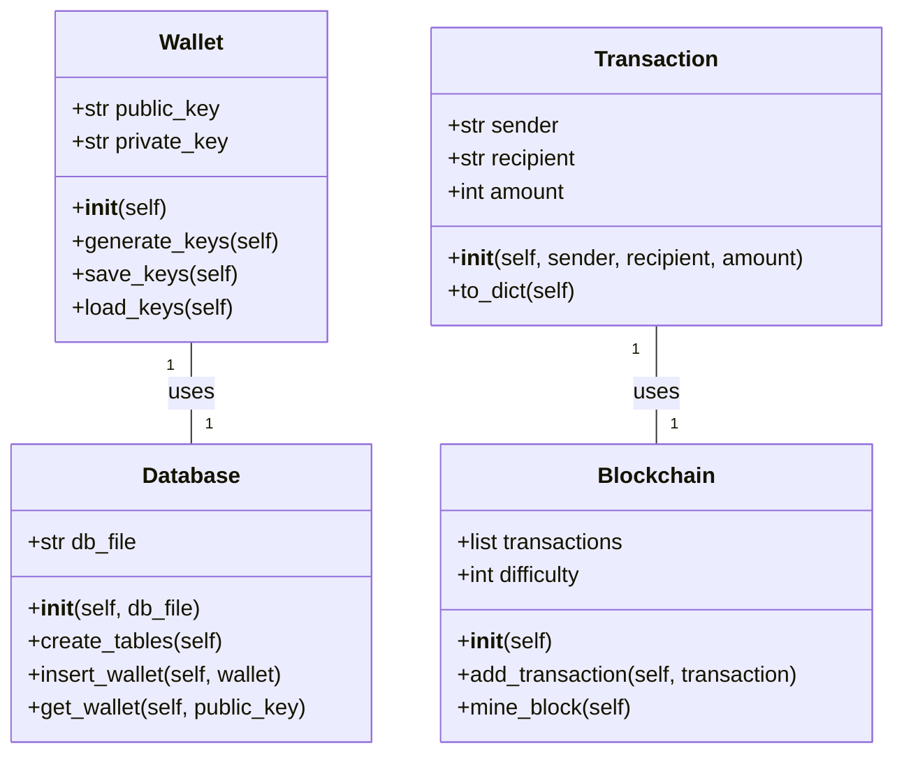
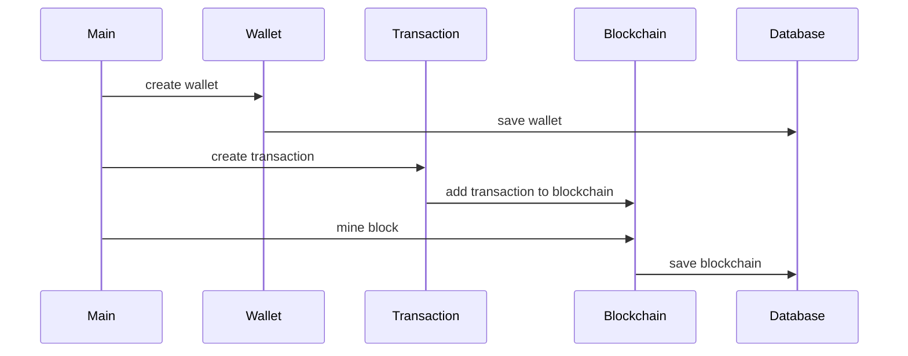

## Implementation approach
The main challenge of this project is to build a secure and efficient Bitcoin wallet in C++. However, as we are designing a Python system, we will focus on creating a Python-based Bitcoin wallet. We will use the BitcoinLib library which is a popular open-source Bitcoin library for Python. It provides functionalities for key generation, transaction creation, and blockchain interaction. We will also use Flask for creating the user interface and SQLite for storing user data. 

## Python package name
```python
"bitcoin_wallet"
```

## File list
```python
[
    "main.py",
    "wallet.py",
    "transaction.py",
    "blockchain.py",
    "database.py",
    "templates/index.html",
    "templates/send.html",
    "templates/receive.html",
    "templates/balance.html"
]
```

## Data structures and interface definitions


## Program call flow


## Anything UNCLEAR
The requirement is clear to me. However, it should be noted that creating a secure Bitcoin wallet is a complex task that requires a deep understanding of cryptography and blockchain technology. The above design is a simplified version and should not be used for storing real Bitcoin.